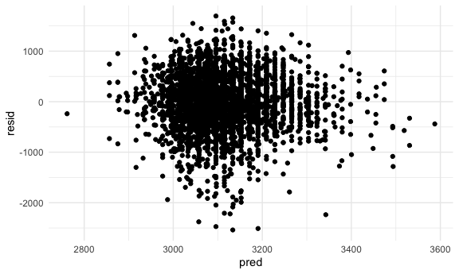
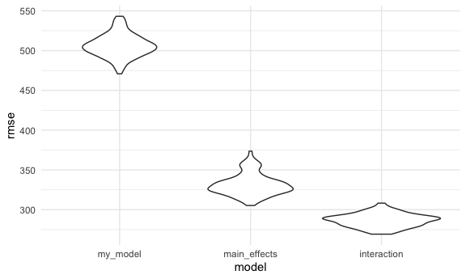
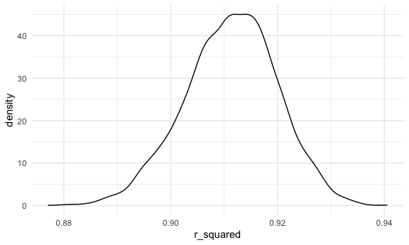
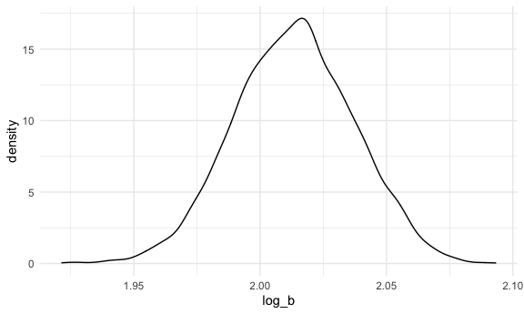

Homework 6
================
Maya Bunyan

This my solution to Homework 6\!

# Problem 1

``` r
homicide_df = 
  read_csv("data/homicide-data.csv", na = c("", "NA", "Unknown")) %>% 
  mutate(
    city_state = str_c(city, state, sep = ", "),
    victim_age = as.numeric(victim_age),
    resolution = case_when(
      disposition == "Closed without arrest" ~ 0,
      disposition == "Open/No arrest"        ~ 0,
      disposition == "Closed by arrest"      ~ 1)
  ) %>% 
  filter(
    victim_race %in% c("White", "Black"),
    city_state != "Tulsa, AL") %>% 
  select(city_state, resolution, victim_age, victim_race, victim_sex)
```

    ## Parsed with column specification:
    ## cols(
    ##   uid = col_character(),
    ##   reported_date = col_double(),
    ##   victim_last = col_character(),
    ##   victim_first = col_character(),
    ##   victim_race = col_character(),
    ##   victim_age = col_double(),
    ##   victim_sex = col_character(),
    ##   city = col_character(),
    ##   state = col_character(),
    ##   lat = col_double(),
    ##   lon = col_double(),
    ##   disposition = col_character()
    ## )

Start with one city.

``` r
baltimore_df =
  homicide_df %>% 
  filter(city_state == "Baltimore, MD")
glm(resolution ~ victim_age + victim_race + victim_sex, 
    data = baltimore_df,
    family = binomial()) %>% 
  broom::tidy() %>% 
  mutate(
    OR = exp(estimate),
    CI_lower = exp(estimate - 1.96 * std.error),
    CI_upper = exp(estimate + 1.96 * std.error)
  ) %>% 
  select(term, OR, starts_with("CI")) %>% 
  knitr::kable(digits = 3)
```

| term              |    OR | CI\_lower | CI\_upper |
| :---------------- | ----: | --------: | --------: |
| (Intercept)       | 1.363 |     0.975 |     1.907 |
| victim\_age       | 0.993 |     0.987 |     1.000 |
| victim\_raceWhite | 2.320 |     1.648 |     3.268 |
| victim\_sexMale   | 0.426 |     0.325 |     0.558 |

Try across cities

``` r
models_results_df = 
  homicide_df %>% 
  nest(data = -city_state) %>% 
  mutate(
    models = 
      map(.x = data, ~glm(resolution ~ victim_age + victim_race + victim_sex, data = .x, family = binomial())),
    results = map(models, broom::tidy)
  ) %>% 
  select(city_state, results) %>% 
  unnest(results) %>% 
  mutate(
    OR = exp(estimate),
    CI_lower = exp(estimate - 1.96 * std.error),
    CI_upper = exp(estimate + 1.96 * std.error)
  ) %>% 
  select(city_state, term, OR, starts_with("CI")) 
```

``` r
models_results_df %>% 
  filter(term == "victim_sexMale") %>% 
  mutate(city_state = fct_reorder(city_state, OR)) %>% 
  ggplot(aes(x = city_state, y = OR)) + 
  geom_point() + 
  geom_errorbar(aes(ymin = CI_lower, ymax = CI_upper)) + 
  theme(axis.text.x = element_text(angle = 90, hjust = 1))
```


# Problem 2

Import and tidy the data

``` r
baby_df = 
  read_csv("./data/birthweight.csv") %>%
  mutate(
    babysex = case_when(
      babysex == 1 ~ "Male",
      babysex == 2 ~ "Female"),
    mrace = case_when(
      mrace == 1 ~ "White",
      mrace == 2 ~ "Black",
      mrace == 3 ~ "Asian",
      mrace == 4 ~ "Puerto Rican",
      mrace == 8 ~ "Other",
      mrace == 9 ~ "Unknown"),
    frace = case_when(
      frace == 1 ~ "White",
      frace == 2 ~ "Black",
      frace == 3 ~ "Asian",
      frace == 4 ~ "Puerto Rican",
      frace == 8 ~ "Other",
      frace == 9 ~ "Unknown"),
    malform = case_when(
      malform == 0 ~ "Absent",
      babysex == 1 ~ "Present")
  ) %>%
  mutate(
    mrace = as.factor(mrace),
    frace = as.factor(frace),
    babysex = as.factor(babysex),
    malform = as.factor(malform)
  )
```

    ## Parsed with column specification:
    ## cols(
    ##   .default = col_double()
    ## )

    ## See spec(...) for full column specifications.

Based on the variables in the dataset, I hypothesize that a good model
for the baby’s birth weight should have mother’s age at delivery, number
of live births prior to pregnancy, and average number of cigarettes
smoked as predictors. I will start by creating my model:

``` r
my_model = 
  lm(bwt ~ momage + parity + smoken, data = baby_df) 
my_model_results = 
  my_model %>%
  broom::tidy()
```

From the tidied output, I see that the p-value for the previous live
births predictor is not significant, while the rest are significant.

Plot of residuals again fitted values.

``` r
baby_df %>% 
  modelr::add_residuals(my_model) %>% 
  modelr::add_predictions(my_model) %>%
  ggplot(aes(x = pred, y = resid)) + 
  geom_point()
```



From the plot, we see that the values are centered around 0 for the
residuals, with a few outlier values.

Create two more models.

``` r
main_effects_model = lm(bwt ~ blength + gaweeks, data = baby_df)
main_effects_model_results = main_effects_model %>% broom::tidy()

interaction_model = lm(bwt ~ bhead*blength*babysex, data = baby_df)
interaction_model_results = interaction_model %>% broom::tidy()
```

Comparison in terms of the cross-validated prediction error.

``` r
baby_df_cross = 
  crossv_mc(baby_df, 100)

baby_df_cross = 
  baby_df_cross %>%
  mutate(
    my_model = map(train, ~lm(bwt ~ momage + parity + smoken, data = baby_df)),
    main_effects_model = map(train, ~lm(bwt ~ blength + gaweeks, data = baby_df)),
    interaction_model = map(train, ~lm(bwt ~ bhead*blength*babysex, data = baby_df))
  ) %>%
  mutate(
    rmse_my_model = map2_dbl(my_model, test, ~rmse(model = .x, data = .y)),
    rmse_main_effects = map2_dbl(main_effects_model, test, ~rmse(model = .x, data = .y)),
    rmse_interaction = map2_dbl(interaction_model, test, ~rmse(model = .x, data = .y)))

baby_df_cross %>% 
  select(starts_with("rmse")) %>% 
  pivot_longer(
    everything(),
    names_to = "model", 
    values_to = "rmse",
    names_prefix = "rmse_") %>% 
  mutate(model = fct_inorder(model)) %>% 
  ggplot(aes(x = model, y = rmse)) + geom_violin()
```



Based on the violin plot, we see that the model I fit was the worst
model with the highest rmse, while the model with the three-way
interaction was the best fit as it had the smallest rmse.

## Problem 3

Import dataset.

``` r
weather_df = 
  rnoaa::meteo_pull_monitors(
    c("USW00094728"),
    var = c("PRCP", "TMIN", "TMAX"), 
    date_min = "2017-01-01",
    date_max = "2017-12-31") %>%
  mutate(
    name = recode(id, USW00094728 = "CentralPark_NY"),
    tmin = tmin / 10,
    tmax = tmax / 10) %>%
  select(name, id, everything())
```

    ## Registered S3 method overwritten by 'hoardr':
    ##   method           from
    ##   print.cache_info httr

    ## using cached file: /Users/mayabunyan/Library/Caches/R/noaa_ghcnd/USW00094728.dly

    ## date created (size, mb): 2020-12-09 12:18:35 (7.536)

    ## file min/max dates: 1869-01-01 / 2020-12-31

Bootstrap

``` r
weather_boot = 
  weather_df %>%
    modelr::bootstrap(n = 5000) %>%
    mutate(
     models = map(strap, ~lm(tmax ~ tmin, data = .x)),
     log_beta = map(models, broom::tidy),
     r_sq = map(models, broom::glance)) 
```

Plot distribution of r-squared values and find 95% CI.

``` r
r_square = 
  weather_boot %>%
  select(-strap, -models, -log_beta) %>%
  unnest(r_sq) %>%
  janitor::clean_names() 

r_square %>% 
  ggplot(aes(x = r_squared)) + geom_density()
```



``` r
conf_int_r = 
  r_square %>%
  summarize(
    ci_lower = quantile(r_squared, 0.025),
    ci_upper = quantile(r_squared, 0.975))
```

The distribution of r-squared values appears to be approximately normal
with a very slightly tail on the left with it centered around 0.91.
Using the 5000 bootstrap estimates, the 95% confidence interval for the
r-squared values is between 0.8936977 and 0.9274807.

Plot distribution of log(beta0\*beta1) values and find 95% CI.

``` r
log_betas = 
  weather_boot %>%
  select(-strap, -models, -r_sq) %>%
  unnest(log_beta) %>%
  janitor::clean_names() %>%
  select(term, estimate) %>%
  mutate(
    term = str_replace(term, "\\(Intercept\\)", "intercept")
  ) %>%
  pivot_wider(
    names_from = "term",
    values_from = "estimate") %>%
  unnest(intercept, tmin) %>%
  mutate(
    log_b = log(intercept*tmin)) 
```

    ## Warning: Values are not uniquely identified; output will contain list-cols.
    ## * Use `values_fn = list` to suppress this warning.
    ## * Use `values_fn = length` to identify where the duplicates arise
    ## * Use `values_fn = {summary_fun}` to summarise duplicates

    ## Warning: unnest() has a new interface. See ?unnest for details.
    ## Try `df %>% unnest(c(intercept, tmin))`, with `mutate()` if needed

``` r
log_betas %>%
  ggplot(aes(x = log_b)) + geom_density()
```



``` r
conf_int_log = 
  log_betas %>%
  summarize(
    ci_lower = quantile(log_b, 0.025),
    ci_upper = quantile(log_b, 0.975))
```

The distribution of log(beta0\*beta1) appears to be approximately
normally distributed with a center around 2.01. Using the 5000 bootstrap
estimates, the 95% confidence interval for the log\_beta is between
1.9669417 and 2.0585284.
